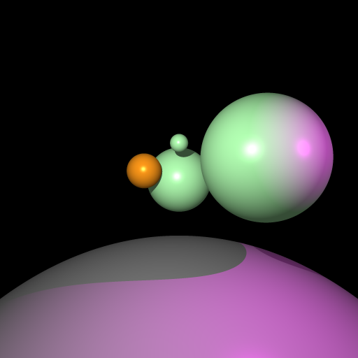

# forth-tracer
A ray tracer written in Forth

[Forth](https://en.wikipedia.org/wiki/Forth_(programming_language)) is a stack-based language from the 70s. I was inspired to write this program in 2012 after ssalbiz gave a tutorial in writing a raytracer at a CSC code party.

## Capabilities
It is a quite rudimentary ray tracer, handling
- spheres
- coloured point light sources
- diffuse and specular shading
- shadows
- ambient light

Looks like I threw in 4x4 anti-aliasing as well (according to the code), but I don't see it in the output.

## Running
You can run Forth using [gforth](https://www.gnu.org/software/gforth/gforth.html). Packages are included in most linux distros, and as part of Homebrew on Mac OS X.

To run the program,

    gforth vector.fs scene.fs tracer.fs
    
The rendered file is saved to `traced.ppm` (a ppm file is an easy image format to output).
